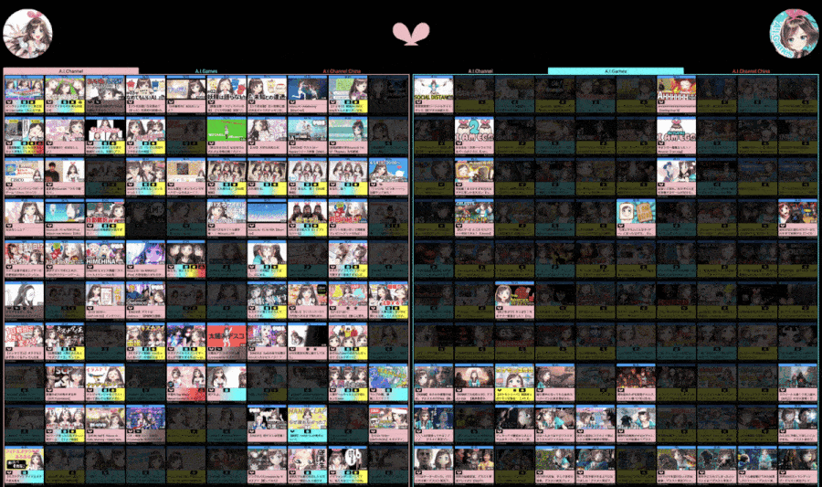

# Kizuna AI Attendance Log

An interactive log of all videos on [A.I.Channel](https://www.youtube.com/aichannel), [A.I.Games](https://www.youtube.com/aigamesdayo), and [A.I.Channel China](https://www.youtube.com/channel/UCArUdy5xj0i0cTuhPHRVMpw) from the day Love-chan and AI-pii were installed to the day they resigned from the identity of Kizuna AI and formed [love-pii Channel](https://www.youtube.com/channel/UCYm8zALd2uHqyy6C1tb4_zA).

Its main purpose is to show which videos AI-chan, Black AI, Love-chan, AI-pii, and AI-bro participated in.

## Symbols

The website's symbols for each AI should be obvious, but here's a chart anyway:

|Symbol|Version of Kizuna AI|
|:-:|-|
||AI-chan / Oyabun / Original / OG|
||Black AI|
||Love-chan / AInee / キュール / AI #2|
||AI-pii / AImouto / すきぴ / AI #3|
||AI-bro / AI-ge / Chinese AI / AI #4|

## Versions

There are two versions of the attendance log.

### [Live Version](https://krazete.github.io/ailog/live)

* uses the YouTube Data API to retrieve up-to-date information for each video
* sometimes messes up the chronological order due to loading videos in batches of 50

### [Static Version](https://krazete.github.io/ailog/static)

* probably has nearly identical data because ratings and view counts don't change much months after a video is published
* loads faster (it isn't held back by quota limits, so videos don't need to be lazy loaded)
* doesn't have any weird order issues

Both versions lazy load all thumbnails for efficiency and faster initialization.

## Additional Notes

### Logging

I reviewed and marked all 488 videos myself.
Though I thoroughly checked each video, I may have missed or mismarked some entries.

I would've missed AI-chan and Love-chan in AI-pii's Christmas livestream if I hadn't checked the last few minutes knowing it was the last of 3 livestreams that day.
I also would've missed Love-chan's participation in AI-pii's 9-hour livestream if I hadn't checked timestamps in the comment section.

If I did get anything wrong, please let me know.

* Gmail: krazete@gmail.com
* Discord: Krazete#7038
* Reddit: u/krazete

### Unlisted and Members-Only Videos

The website uses the default Channel Uploads playlist for each channel, which means it only includes publicly listed videos.

The [A.I.Games Video List](https://www.youtube.com/playlist?list=PLWkRfirH7n-tCgddNgyWCSK8QGsK8EV7L) playlist has a bunch of additional videos which are unlisted and members-only, but nearly all of these have a publicly listed digest version and are thus better off excluded.

The most notable exception is [Love-chan and AI-pii's gameplay of Man of Medan](https://youtu.be/dzmzokLdeIA), which is unlisted but thankfully not members-only. Other exceptions include [upd8's Pokémon Sword and Shield Tournament](https://youtu.be/AQuB3W1p4Yg) and [AI-pii's PUBG Lite stream](https://youtu.be/3kqEOhDv-7o), which are members-only.

### A.I.Channel China

I realize A.I.Channel China's videos were uploaded on Bilibili much earlier than their YouTube publish date.
This means AI-bro's content is not truly in chronological order.
More importantly, it means some later videos which should be included are not displayed here.

Due to the rarity of collaborations on A.I.Channel China, this error is a minor one.
Thus, I did not make any attempt to fix the issue.

### Motivation

This project was made mostly in response to the common [misinformed claim](SUPPLEMENTARY.md) that the original has been replaced or was being forced out by upd8.
This was never the case.

AI-chan said during AI Party 2019 that [she never planned on leaving](https://warosu.org/jp/thread/21612492#p21615639).
A month later, AI-pii [addressed the growing concerns in her livestream](https://youtu.be/IwIoDYymgVs?t=61) saying AI-chan wasn't leaving, and she'd bring her back if she did.

During Love-chan's and AI-pii's existence as Kizuna AIs, AI-chan:

* released the song [Sky High](https://youtu.be/yLrstz80MKs), the cover song [Kizunami](https://youtu.be/vHeK-SDTMyU), and the album [Replies](https://youtu.be/Io_GOr3YAN0),
* [performed](https://i.imgur.com/nAEKjBZ.png) at [Summer Sonic](https://youtu.be/O57ueFS0M6o), [DIVE XR Festival](https://twitter.com/aichan_nel/status/1175769837622030337), [J-WAVE Innovation World Festa](https://twitter.com/aichan_nel/status/1173189719578042369), [Bilibili Macro Link Visual Release](https://twitter.com/aichan_nel/status/1152094751849504770), and
* cohosted the television program [てえてえTV](https://cu.ntv.co.jp/program/tetete2/) alongside fellow upd8 members the Omega Sisters

Meanwhile, her voice model Kasuga Nozomi took on some voice acting roles:

* Granbelm (as Mimi Rin)
* Infinite Dendrogram (as the interface AI)
* Shirobako Movie (as a virtual idol *(I haven't seen it; I'm just taking Discord user Guest#3616's word for it.)*)

In short, she wasn't replaced.
She was busy.

Hopefully this project helps to clarify the fact that AI-chan never left.
